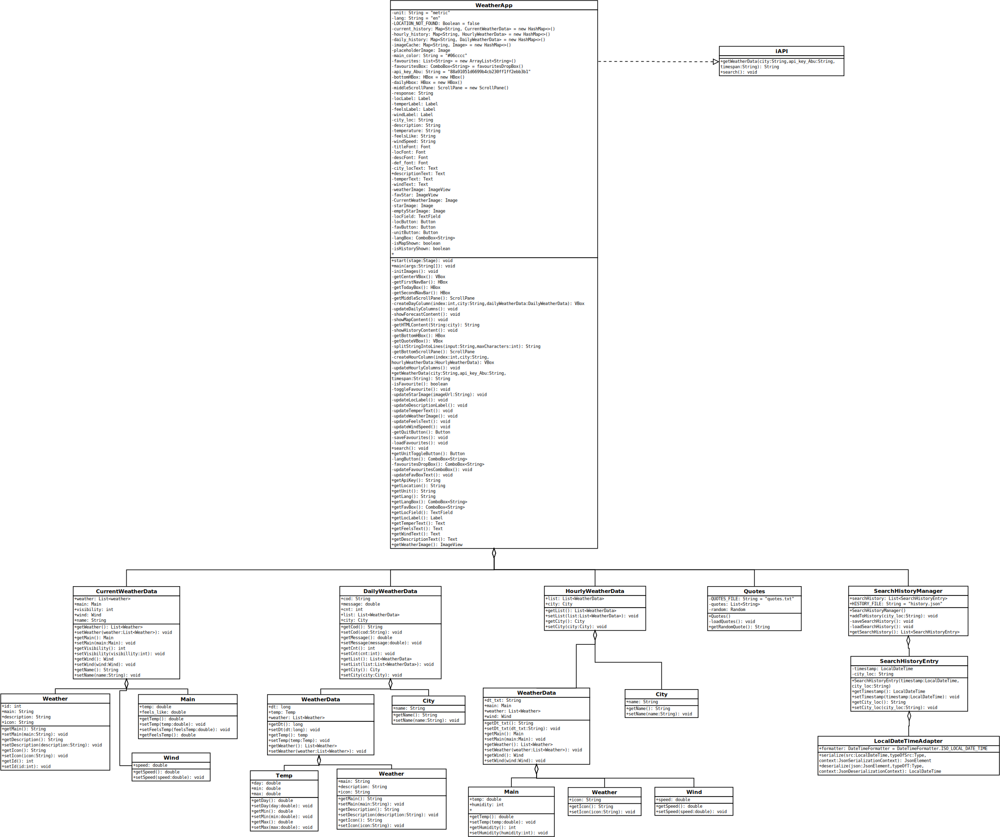

Programming 3 Group Project: Weather App
Overview

This repository contains the source code for a Weather App developed as part of the Programming 3 group project. The Weather App is designed to provide users with current and forecasted weather information for various locations.
Features

    Current Weather Data: Retrieve and display real-time weather data for a specific location, including temperature, wind speed, and visibility.
    Hourly Forecast: Display an hourly forecast for the next 24 hours, showing temperature, wind speed, and humidity.
    Daily Forecast: Provide a 7-day weather forecast with details on daily temperature, weather conditions, and more.
    Search History: Previously searched locations can be seen as timestamps in the history log.
    Favorites: Users can mark locations as favorites for easy access to frequently checked weather updates. Favourites can be deleted all at once or idividually.
    Internationalization: Support multiple languages for user interface elements.
    Units: Temperature and wind speed can be seen in either metric or imperial units.
    Memory: The program saves last searched location, last used units and last used language as defaults for next time the program is started.

Components

The project is structured into several components:

    Weather App: The main application that interacts with the OpenWeatherMap API to fetch weather data and displays it to the user.
    Search History Manager: Manages the search history functionality, storing and retrieving search entries with timestamps.
    Quotes: A class that provides random quotes, adding a motivational or interesting element to the application.

How to Run

    Clone this repository to your local machine.
    Open the project in your preferred Java IDE.
    Compile and run the WeatherApp class to start the Weather App.

Dependencies

    Gson: This project uses the Gson library for handling JSON serialization and deserialization.

Contributors with student numbers

    Abdurrahman Faig (H290733), Hans Ravna-Pieski (151247084), My Hoang (151395127)

## UML diagram of the application

